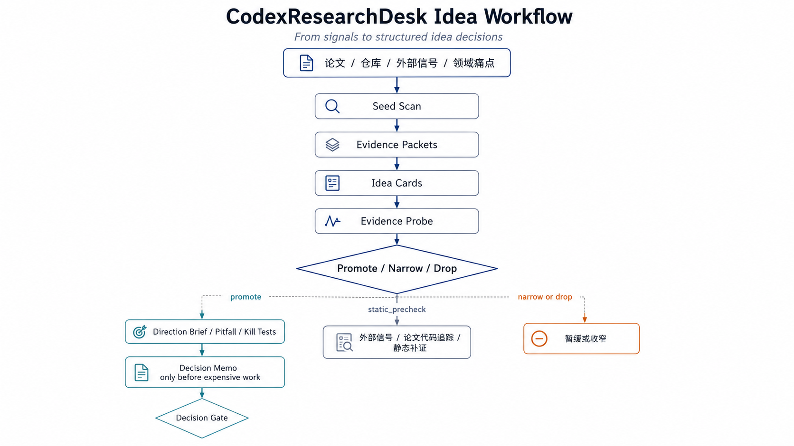

<div align="center">
  

  <h1>CodexResearchDesk</h1>

  <p>
    <strong>面向科研 idea 早筛、方向分诊和实验门控的 Codex App 工作台</strong>
  </p>

  <p>
    先判断一个 idea 是否值得做、哪里可能踩坑、需要什么最低成本证据；
    只有 gate 放行后，才进入训练、GPU 或长任务。
  </p>

  <p>
    <a href="https://github.com/Eternite-0/CodexResearchDesk"></a>
    
    
    
  </p>
</div>

---

## 定位

CodexResearchDesk 不是自动生成论文的流水线，也不是“给一个 A+B idea 就开跑实验”的执行器。它是一个前置研究控制台：

- **先产 idea 再筛 idea**：从论文、代码库、外部信号和领域痛点中形成候选 idea cards，再拆出核心 claim、falsifier 和最低成本证据。
- **先找坑**：检查数据、指标、基线、新意、工程、评价和论文贡献风险。
- **先看外部信号**：用 GitHub、alphaXiv/HF Papers、HN、Semantic Scholar/OpenAlex 和手工社媒/企业信号判断方向是否只有 hype。
- **先追论文代码**：从 arXiv、Papers with Code、alphaXiv 和 GitHub 反查论文对应代码库，做只读静态尽调。
- **先做门控**：Decision Memo 和 `decision.json` 决定是否允许进入实验。

核心原则：**实验是昂贵的信息购买；不能改变决策的实验，不值得运行。**

## 产 Idea 工作流

主线只有一条：先从材料里产出候选 idea cards，再只对少数候选补关键证据。不是每个候选都跑完整流程。

```text
Seed Scan
→ Evidence Packets
→ Idea Cards
→ Evidence Probe
→ Promote / Narrow / Drop
→ Optional External Arena Backtest
→ Decision Memo only before expensive work
```

<p align="center">
  
</p>

各步的作用：

| 阶段 | 作用 | 默认成本 |
|---|---|---:|
| Seed Scan | 轻扫论文、仓库、外部信号和领域痛点，只收集能产 idea 的种子。 | 0 GPU |
| Evidence Packets | 子代理或主 Agent 分块取证，每个 packet 只回答一个问题。 | 0 GPU |
| Idea Cards | 生成候选 idea，并强制写清 claim、非 A+B、避坑点、隐藏坑、falsifier。 | 0 GPU |
| Evidence Probe | 只对前 1-3 个候选查关键外部信号、论文代码、指标或最低成本 kill test。 | 0 GPU |
| Promote / Narrow / Drop | 明确哪些继续、哪些收窄、哪些放弃。 | 0 GPU |
| External Arena Backtest | 在独立 ResearchSkillArena 中，用 t-1 前论文冻结 idea，再看 t 之后论文是否触及，用于评估 skill 的提前发现能力。 | 0 GPU |
| Decision Memo | 只有下一步会消耗 GPU、训练、长任务或正式汇报时才生成。 | 视 verdict 而定 |

## Temporal Holdout 回测

Temporal Holdout 不是普通查新，也不是给当前 idea 找 related work。它评估的是：**如果 `$research-desk` 只看到 cutoff 年及以前的论文，它能不能提前生成后来被未来论文触及的 idea。**

因此它回答的是系统质量问题：

```text
过去论文 t-1
→ 历史-only idea 生成
→ 冻结 IDEAS_FROZEN.md
→ 未来论文 t
→ 候选命中账本
→ 实验图表审阅
→ 回测报告
```

### 什么时候用

用它：

- 当你想知道这套调研 workflow 是否真的有“提前发现方向”的能力。
- 当你要比较不同 skill、不同提示词、不同模型版本的 idea 生成质量。
- 当导师或合作者问“这不是事后诸葛亮吗？”时，用回测报告作为系统级证据。

不要用它：

- 不要把它当成当前 idea 的查新。当前 idea 仍然需要正常 novelty check。
- 不要把它当成实验放行。实验仍然需要 Decision Memo 和 gate。
- 不要在普通快速调研时默认跑；只有用户明确说“回测 / holdout / 自动跑竞技场 / 评估系统质量”才跑。

### 为什么 arena 单独放

`CodexResearchDesk` 是工作台，被测系统在这里生成 idea。`D:\ResearchSkillArena` 是考场，负责保存过去/未来语料、命中账本、Papers.cool 预筛和回测报告。

这样分开是为了防泄漏：未来窗口论文、命中标签和评分报告不回流到被测系统，避免下一次 `$research-desk` 在无意中读到答案。

Desk 里只保存轻量 link：

```text
projects/<project-slug>/arena-links/<run-slug>.json
```

### Codex 驱动流程

你仍然在 `D:\CodexResearchDesk` 里发起任务。最自然的提示词是：

```text
Use $research-desk 调研 <topic>，生成中文 Idea Sprint，并在结束后自动跑 ResearchSkillArena temporal holdout 回测。年份没指定就按默认窗口。
```

如果手动跑 bridge，完整阶段是：

```powershell
python .\tools\arena_holdout_bridge.py prepare `
  --project <project-slug> `
  --run <run-slug> `
  --topic "<historically-valid topic>" `
  --cutoff-year 2024 `
  --future-start 2025 `
  --future-end 2026
```

`prepare` 会在 arena 中创建 config、历史 prompt，并收集 `past_corpus.jsonl`。然后 `$research-desk` 只能读：

```text
D:\ResearchSkillArena\tasks\<project-slug>\<run-slug>\historical_idea_prompt.md
D:\ResearchSkillArena\tasks\<project-slug>\<run-slug>\past_corpus.jsonl
```

生成历史-only ideas 后冻结：

```powershell
python .\tools\arena_holdout_bridge.py submit-ideas `
  --project <project-slug> `
  --run <run-slug> `
  --ideas-file <path-to-IDEAS_FROZEN.md>
```

再生成未来候选和预筛队列：

```powershell
python .\tools\arena_holdout_bridge.py make-ledger --project <project-slug> --run <run-slug>
```

不确定进度时：

```powershell
python .\tools\arena_holdout_bridge.py status --project <project-slug> --run <run-slug>
```

### Arena 产物

核心产物都在 `D:\ResearchSkillArena`：

```text
tasks/<project>/<run>/
  config.json
  past_corpus.jsonl
  future_corpus.jsonl
  historical_idea_prompt.md
submissions/<project>/<run>/
  IDEAS_FROZEN.md
  metadata.json
reports/<project>/<run>/
  hit_ledger.csv
  papers_cool_insights.jsonl
  papers_cool_review_brief.md
  papers_cool_triage.csv
  papers_cool_triage.md
  TEMPORAL_HOLDOUT_REPORT.md
output/pdf/
  <project>_<run>_temporal_holdout.pdf
```

### Papers.cool 省 Token 漏斗

`make-ledger` 默认会对 arXiv 候选抓取 Papers.cool/Kimi 解读并生成预筛队列。Codex 应先读：

```text
D:\ResearchSkillArena\reports\<project>\<run>\papers_cool_triage.md
```

预筛结果只决定是否值得打开 PDF：

| 字段 | 含义 |
|---|---|
| `needs_pdf_review=yes` | 优先打开 PDF，看图、表、消融和指标。 |
| `needs_pdf_review=maybe` | 等 `yes` 看完后再扫。 |
| `needs_pdf_review=no` | 暂缓，不消耗 PDF 阅读 token。 |

Papers.cool/Kimi 解读不能单独支持 `direct_hit` 或 `partial_hit`。真正命中必须回到论文实验图表。

可选命令：

```powershell
python .\tools\arena_holdout_bridge.py enrich-cool --project <project> --run <run>
python .\tools\arena_holdout_bridge.py triage-cool --project <project> --run <run>
python .\tools\arena_holdout_bridge.py make-ledger --project <project> --run <run> --skip-cool
```

### 最终报告

审完 `hit_ledger.csv` 后生成报告和 PDF：

```powershell
python .\tools\arena_holdout_bridge.py finalize-report --project <project-slug> --run <run-slug>
```

`finalize-report` 会调用 arena 的中文风格检查和 PDF 渲染。报告仍保存在 `D:\ResearchSkillArena`，不复制回 Desk。

## 项目产物

每个项目维护自己的目录，避免不同方向互相污染。Quick Scan 可以只在对话中完成；下面这些文件只在进入 Standard Triage 或 Full Gate 时按需产生：

```text
projects/<project-slug>/
  decisions/<idea-slug>/
    DECISION_MEMO.md
    decision.json
  signals/<idea-slug>/
    EXTERNAL_SIGNAL_LEDGER.md
    external_signals.json
    PAPER_CODE_LEDGER.md
    paper_code.json
  idea-sprints/
    IDEA_SPRINT.md
  evidence-packets/<run-slug>/
    <packet-slug>.md
    EVIDENCE_PACKET_INDEX.md
  arena-links/
    <run-slug>.json
  research-wiki/
  output/pdf/
    <sprint-slug>_idea_sprint.pdf
  tmp/pdfs/
```

关键文件：

- `DECISION_MEMO.md`：完整推理、证据、风险和最终 verdict。
- `decision.json`：机器可读 gate 状态。
- `EXTERNAL_SIGNAL_LEDGER.md`：外部软门控账本。
- `external_signals.json`：外部信号结构化数据。
- `PAPER_CODE_LEDGER.md`：论文到代码库追踪账本。
- `paper_code.json`：代码库静态尽调结构化数据。
- `IDEA_SPRINT.md`：候选 idea cards 和避坑台账，按需生成。
- `evidence-packets/`：子代理或分块取证结果，主 Agent 优先读这些短证据包。
- `arena-links/`：外部 ResearchSkillArena run 的轻量索引，只保存路径和状态，不保存未来语料。
- `<sprint-slug>_idea_sprint.pdf`：Idea Sprint 快速审阅版 PDF。
- `output/pdf/`：正式 PDF 交付物。
- `research-wiki/`：项目级长期记忆。

## 快速开始

安装依赖：

```powershell
python -m pip install -r requirements.txt
```

运行自检：

```powershell
python .\tools\self_check.py
```

用 Codex App 产出候选 idea：

```text
Use $research-desk to generate idea cards around SAE features and MoE expert routing. Start from papers, repos, external signals, and known field pitfalls. Do not create a Decision Memo.
```

如果已经有一个具体 idea，再让它只做单卡避坑：

```text
Use $research-desk to make one idea card for whether SAE features can explain MoE expert routing. Focus on why it is not A+B, hidden pitfalls, and the lowest-cost kill test. Do not create files.
```

单独抓外部信号：

```powershell
python .\tools\external_signal_fetch.py scout "AutoResearchClaw autonomous research" `
  --project sae-moe-interpretability `
  --idea signal-explicit-smoke `
  --github-repo aiming-lab/AutoResearchClaw `
  --arxiv-id 2605.20025
```

单独追踪论文代码库：

```powershell
python .\tools\paper_code_fetch.py scout "AutoResearchClaw autonomous research" `
  --project sae-moe-interpretability `
  --idea paper-code-smoke `
  --github-repo aiming-lab/AutoResearchClaw `
  --arxiv-id 2605.20025
```

评估 idea workflow 是否能提前发现方向，请使用独立 arena，而不是把未来语料放进本仓库：

```powershell
python .\tools\arena_holdout_bridge.py prepare `
  --project coding-agent `
  --run swebench-backtest-2023 `
  --topic "coding agents GitHub issue repair SWE-bench" `
  --cutoff-year 2023 `
  --future-start 2024 `
  --future-end 2026
```

随后让 `$research-desk` 读取 arena 生成的 `historical_idea_prompt.md`，只允许使用 arena 的 `past_corpus.jsonl`，并产出历史-only ideas。保存后用 bridge 冻结：

```powershell
python .\tools\arena_holdout_bridge.py submit-ideas `
  --project coding-agent `
  --run swebench-backtest-2023 `
  --ideas-file .\projects\coding-agent\idea-sprints\swebench-backtest-2023\IDEAS_FROZEN.md
```

之后继续生成候选命中账本：

```powershell
python .\tools\arena_holdout_bridge.py make-ledger --project coding-agent --run swebench-backtest-2023
```

这一步默认会对 arXiv 候选调用 Papers.cool/Kimi 解读，并在 arena 里生成：

```text
D:\ResearchSkillArena\reports\coding-agent\swebench-backtest-2023\papers_cool_review_brief.md
D:\ResearchSkillArena\reports\coding-agent\swebench-backtest-2023\papers_cool_triage.md
```

先读 `papers_cool_triage.md`，只对 `needs_pdf_review=yes` 的候选打开 PDF；`maybe` 等高优先级看完再说。这样才真正省 token。审阅 `hit_ledger.csv` 时必须看未来论文的图、表、消融、指标和实验设置，不能只凭 Kimi 解读或论文结论判 `direct_hit`。审完后再渲染报告：

```powershell
python .\tools\arena_holdout_bridge.py finalize-report --project coding-agent --run swebench-backtest-2023
```

不确定当前到哪一步时：

```powershell
python .\tools\arena_holdout_bridge.py status --project coding-agent --run swebench-backtest-2023
```

如果不想访问 Papers.cool，可在生成账本时加 `--skip-cool`；如果只想补抓解读，可运行：

```powershell
python .\tools\arena_holdout_bridge.py enrich-cool --project coding-agent --run swebench-backtest-2023
```

如果已经有缓存，只想重建 PDF 审阅优先级队列：

```powershell
python .\tools\arena_holdout_bridge.py triage-cool --project coding-agent --run swebench-backtest-2023
```

检查某个项目是否允许实验：

```powershell
python .\tools\decision_gate.py latest .\projects\<project-slug> --mode experiment
```

检查是否允许静态工作：

```powershell
python .\tools\decision_gate.py latest .\projects\<project-slug> --mode static
```

## Skills

Codex App 会从 `.agents/skills/` 发现仓库级 skills。

### Desk Layer

| Skill | 作用 |
|---|---|
| `$research-desk` | 顶层入口，负责第一性原理拆解、证据调度和 gate 路由。 |
| `$direction-brief` | 生成早期方向简报。 |
| `$pitfall-radar` | 做 skeptical pre-mortem，提前找坑。 |
| `$external-signal-scout` | 用公开外部信号暴露 hype、工程和指标风险。 |
| `$paper-code-scout` | 根据论文反查代码库，做只读静态尽调并暴露后续复现风险。 |
| `$direction-scorecard` | 按 7 个维度评分并给出推荐 verdict。 |
| `$kill-test-generator` | 生成低成本淘汰测试。 |
| `$temporal-holdout-arena` | 在当前 Desk 内驱动外部 ResearchSkillArena，回测 workflow 是否能从历史论文提前生成方向。 |
| `$decision-memo` | 生成正式 Decision Memo、PDF 和 gate JSON。 |
| `$report-style-auditor` | 交付前检查中文报告的模板残留和 AI 味。 |
| `$preflight-gate` | 在实验、pilot、GPU 任务前执行硬门控。 |
| `$aris-runner` | 将具体取证任务路由到 ARIS Core。 |

### ARIS Core

| 类型 | Skills |
|---|---|
| 文献与检索 | `research-lit`, `arxiv`, `openalex`, `semantic-scholar`, `deepxiv` |
| 查新与审查 | `novelty-check`, `research-review`, `kill-argument` |
| 长期记忆 | `research-wiki`, `wiki-enrich` |
| 实验与结果 | `experiment-plan`, `experiment-bridge`, `run-experiment`, `monitor-experiment`, `result-to-claim` |
| 写作与审计 | `citation-audit`, `paper-claim-audit`, `paper-plan` |

## Tools

| 工具 | 作用 |
|---|---|
| `tools/decision_gate.py` | 机械执行 go / no-go 检查。 |
| `tools/arena_holdout_bridge.py` | 从 CodexResearchDesk 驱动外部 ResearchSkillArena 的 temporal holdout 回测。 |
| `tools/external_signal_fetch.py` | 抓取外部软门控信号并生成项目级账本。 |
| `tools/paper_code_fetch.py` | 从论文追踪代码库并生成项目级静态尽调账本。 |
| `tools/render_markdown_pdf.py` | 中文友好的 Markdown 到 PDF 渲染。 |
| `tools/research_wiki.py` | 项目级研究记忆管理。 |
| `tools/arxiv_fetch.py` | arXiv 检索与下载。 |
| `tools/openalex_fetch.py` | OpenAlex 学术图谱检索。 |
| `tools/semantic_scholar_fetch.py` | Semantic Scholar 检索。 |
| `tools/check_report_style.py` | 检查中文报告中的英文模板残留。 |
| `tools/check_ai_style.py` | 检查聊天残留、模糊归因、宣传腔和公式化表达。 |
| `tools/threat_scan.py` | 扫描会重新进入 agent 上下文的 wiki 内容。 |
| `tools/self_check.py` | 检查仓库可移植性、依赖、skills 和路径泄漏。 |

## Idea Card 输出口径

Idea Card 不是头脑风暴列表。每个候选必须回答：

- **core claim**：一句可证伪主张。
- **seed evidence**：来自哪些论文、仓库、benchmark、外部信号或领域痛点。
- **why not A+B**：非平凡机制、问题重构或评价角度是什么。
- **pitfall avoided**：它主动避开什么已知死路。
- **hidden pitfall**：最可能失败在哪里。
- **traceability**：关键代码、数据、checkpoint、metric 或 eval 入口是否可追踪。
- **lowest-cost kill test**：不用训练或最低成本就能改变决策的检查。

默认只把 1-3 个候选推进到后续补证。

中文 Idea Cards、Idea Sprint、Direction artifacts 和 Decision Memo 交付前都要走 `$report-style-auditor` 口径：去掉聊天残留、宣传腔、模糊归因和模板味，但不能改强证据、结论、数字、路径或 gate 状态。

## 防上下文爆炸

复杂调研默认用“主 Agent 编排 + 子代理 Evidence Packets”：

- 主 Agent 只负责拆任务、合成 idea cards、决定 promote/narrow/drop。
- 子代理只回答一个窄问题，例如 paper-code trace、external signal、pitfall review、kill test design。
- 每个子代理输出 `projects/<project>/evidence-packets/<run>/<packet>.md`。
- 主 Agent 优先读取 packet 和 `EVIDENCE_PACKET_INDEX.md`，不直接吞论文全文、README 全文或源码树。
- 只有 packet 冲突、关键证据缺失、或要写正式 Decision Memo 时，才打开原始来源。
- 子代理不得生成 Decision Memo、不得设计训练实验、不得全量爬 repo。

相关模板：

- `templates/SUBAGENT_TASK_TEMPLATE.md`
- `templates/EVIDENCE_PACKET_TEMPLATE.md`
- `templates/EVIDENCE_PACKET_INDEX_TEMPLATE.md`

示例提示词：

```text
Use $research-desk to generate idea cards for <topic>.

Use subagents for bounded evidence packets:
1. Seed Scan packet: closest papers, benchmarks, and field pain points.
2. Paper-Code Trace packet: whether key papers have repos, data, checkpoint, and eval signals.
3. External Signal packet: GitHub, alphaXiv/HF Papers, HN/OpenAlex/Semantic Scholar, and manual enterprise/social signals.
4. Pitfall Review packet: data, metric, baseline, novelty, engineering, evaluation, and contribution traps.

Each subagent must write one packet under:
projects/<project>/evidence-packets/<run-slug>/<packet-slug>.md

Each packet must answer one question, stay compact, cite links/paths, include negative evidence, and end with promote/static_precheck/narrow/drop.

The main Agent should only read packet summaries and then produce IDEA_SPRINT.md plus PDF. Do not create a Decision Memo or run experiments.
```

## Decision Gate

允许的 verdict：

| Verdict | 含义 | 是否允许实验 |
|---|---|---|
| `GO` | 证据足够强，可以进入实验。 | 允许 |
| `STATIC_ONLY` | 只能做文献、静态分析、公开 checkpoint、非训练探针。 | 阻断训练 |
| `NEEDS_MORE_EVIDENCE` | 关键证据缺失，需要继续补证。 | 阻断 |
| `NO_GO` | 当前不值得推进。 | 阻断 |
| `USER_OVERRIDE` | 用户明确接受风险并记录理由。 | 需显式 override |

`decision.json` 的 v0.2+ 字段示例：

```json
{
  "direction_score": 57,
  "risk_level": "high",
  "main_claim": "The core research claim.",
  "top_risks": ["risk 1", "risk 2", "risk 3"],
  "evidence_gaps": ["missing evidence"],
  "external_signal_score": 42,
  "external_signal_summary": "GitHub 有实现但缺少独立 benchmark，存在 hype 风险。",
  "external_signal_ledger": "projects/demo/signals/idea/EXTERNAL_SIGNAL_LEDGER.md",
  "hype_risk": "medium",
  "paper_code_trace_score": 51,
  "paper_code_summary": "发现候选仓库，但 README 未明确绑定 arXiv ID，且缺少 evaluation 入口。",
  "paper_code_ledger": "projects/demo/signals/idea/PAPER_CODE_LEDGER.md",
  "code_availability_risk": "medium",
  "kill_tests": [],
  "allowed_next_actions": ["文献查新", "静态分析"],
  "blocked_actions": ["GPU 训练"],
  "next_review_condition": "完成低成本检查后复审。"
}
```

外部信号是软门控：它影响风险、优先级和下一步检查，但不单独决定 `GO` 或 `NO_GO`。

## 交付检查

Idea Sprint 写入文件后渲染 PDF：

```powershell
python .\tools\render_markdown_pdf.py `
  .\projects\<project-slug>\idea-sprints\<sprint-slug>\IDEA_SPRINT.md `
  --output .\projects\<project-slug>\output\pdf\<sprint-slug>_idea_sprint.pdf `
  --preview `
  --preview-dir .\projects\<project-slug>\tmp\pdfs
```

中文 Decision Memo 交付前运行：

```powershell
python .\tools\check_report_style.py .\projects\<project-slug>\decisions\<idea-slug>\DECISION_MEMO.md
python .\tools\check_ai_style.py .\projects\<project-slug>\decisions\<idea-slug>\DECISION_MEMO.md
```

渲染 PDF：

```powershell
python .\tools\render_markdown_pdf.py `
  .\projects\<project-slug>\decisions\<idea-slug>\DECISION_MEMO.md `
  --output .\projects\<project-slug>\output\pdf\<idea-slug>_decision_memo.pdf `
  --preview `
  --preview-dir .\projects\<project-slug>\tmp\pdfs
```

## 示例

仓库内置 SAE / MoE interpretability 样例决策：

```powershell
python .\tools\decision_gate.py latest .\projects\sae-moe-interpretability --mode experiment
```

预期结果：

```text
BLOCK: STATIC_ONLY - STATIC_ONLY blocks experiment work
```

这表示当前 idea 可以继续文献补证、公开 checkpoint 分析和静态验证，但不能直接启动训练或 GPU pilot。

v0.2 方向分诊示例：

```text
examples/vlm-explainable-open-set-anomaly/
  DIRECTION_BRIEF.md
  PITFALL_RADAR.md
  DIRECTION_SCORECARD.md
  KILL_TESTS.md
  decision.json
```

## 设计原则

- **真实优先于动量**：弱 idea 不应被漂亮话包装。
- **先定义 falsifier**：没有可否定条件，就不要急着设计实验。
- **外部热度不是可信度**：GitHub stars、alphaXiv votes、社媒讨论只能暴露风险和优先级。
- **代码可追踪不是复现成功**：官方仓库、README、license、eval 脚本和数据/权重链接只是早筛证据，不等于论文结果真实。
- **先杀坑再开跑**：最低成本淘汰测试优先于 GPU pilot。
- **门控必须可审计**：所有 expensive work 都必须由 Decision Memo 和 `decision.json` 放行。
- **PDF 是正式交付物**：给导师、合作者或组会看的内容不应只停留在 Markdown。

## 开源说明

CodexResearchDesk 包含一组精选的 ARIS / AutoResearch skills 与工具，派生自 [wanshuiyin/Auto-claude-code-research-in-sleep](https://github.com/wanshuiyin/Auto-claude-code-research-in-sleep)，遵循 MIT License。详见 [NOTICE](./NOTICE) 与 [vendor/ARIS_LICENSE](./vendor/ARIS_LICENSE)。

README 中的 Codex 图标来自 [LobeHub Icons / Dashboard Icons](https://dashboardicons.com/icons/external/codex-color)。本项目不是 OpenAI 官方项目，也不代表 OpenAI 背书或赞助。

## License

MIT. See [LICENSE](./LICENSE).
