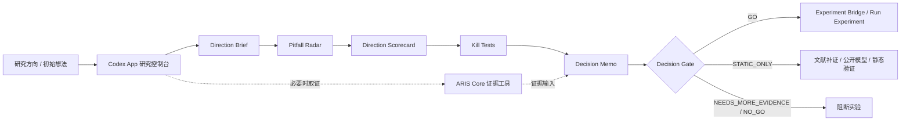

<div align="center">
  

  <h1>CodexResearchDesk</h1>

  <p>
    <strong>面向科研方向分诊的 Codex App 智能工作台</strong>
  </p>

  <p>
    以 Codex App 为控制中枢，以 ARIS / AutoResearch 为能力引擎，
    在消耗算力之前，帮助研究者判断什么不该做、先验证什么、何时才值得进入实验。
  </p>

  <p>
    <a href="https://github.com/Eternite-0/CodexResearchDesk"></a>
    
    
    
  </p>
</div>

---

## 项目愿景

CodexResearchDesk is a research direction triage desk. It helps researchers decide what not to do, what to validate first, and when an idea deserves expensive experiments.

科研系统真正稀缺的不是 idea，而是 **在不确定性极高、资源极有限的条件下，判断一个 idea 是否值得下注的能力**。

AutoResearch / ARIS 已经提供了非常完整的科研自动化能力：文献检索、查新、审稿、wiki 记忆、实验桥接、论文审计、PDF 输出。但对于很多真实场景来说，最先需要解决的问题不是“如何自动跑完整流水线”，而是：

> **这个研究想法，现在是否值得消耗我的时间、GPU、API 额度和导师信任？**

CodexResearchDesk v0.2 的定位就是这个前置分诊层。它不试图替代 AutoResearch，也不把自己扩张成完整 AutoResearch executor，而是将其能力重新组织为一个 Codex App 驱动的研究方向分诊工作台：先定方向，再查坑；先做低成本 kill tests，再决定是否写正式 Decision Memo；只有 gate 放行后才进入昂贵阶段。

## 核心理念

CodexResearchDesk 将一次科研推进拆成三个层次：

1. **决策层**：由 Codex App 驱动，负责追问、拆解、审查、裁决。
2. **证据层**：调用 ARIS / AutoResearch 的精选 skills 与工具，完成文献、查新、审稿、wiki、实验规划等工作。
3. **执行层**：只有在 Decision Gate 放行后，才允许进入实验桥接、训练、GPU 任务或长时间运行流程。

换句话说，Codex App 不是单独科研的“大脑幻觉机”，而是研究控制台；ARIS Core 不是失控的自动流水线，而是受控调用的能力引擎。

## 系统架构



## 为什么不是又一个自动科研流水线

传统自动科研流水线容易把“生成更多 idea”和“启动更多实验”当成进展。但在资源紧张的情况下，错误实验比没有实验更危险：它会消耗算力、污染判断、制造伪进展，还可能让后续写作建立在脆弱假设上。

CodexResearchDesk 的默认动作不是启动实验，而是生成一份 **Decision Memo**。它必须回答：

- 核心 claim 到底是什么？
- 这个 claim 成立需要哪些必要条件？
- 当前证据中，哪些是支持证据，哪些只是相邻证据？
- 最强反对理由是什么？
- 最低成本的 kill test 是什么？
- 现在是否允许进入训练、GPU 或长任务？

如果这些问题答不清楚，系统会阻断实验，而不是鼓励“先跑一下看看”。

## v0.2 Direction Triage Mode

v0.2 的默认工作流是：

```text
Idea
→ Direction Brief
→ Pitfall Radar
→ Direction Scorecard
→ Kill Tests
→ Decision Memo
→ Decision Gate
```

各 artifact 的作用：

| Artifact | 作用 | 默认成本 |
|---|---|---:|
| Direction Brief | 用 1-2 页说明方向、核心 claim、证据需求、Top 3 risks 和初步 verdict。 | 0 GPU |
| Pitfall Radar | 预判 data、metric、baseline、novelty、engineering、evaluation、paper/contribution 坑。 | 0 GPU |
| Direction Scorecard | 用 7 个维度 1-5 分打分，输出 total score /100、risk_level 和 recommended verdict。 | 0 GPU |
| Kill Tests | 设计至少 3 个低成本测试，其中至少 1 个能快速否定或收窄方向。 | 默认 0 GPU |
| Decision Memo | 在方向值得正式裁决时，形成导师可审阅的证据备忘录和 gate JSON。 | 视 verdict 而定 |

这条链路的目标是强化“定方向、防踩坑、低成本验证”。它不会自动启动训练、GPU pilot 或长时间实验。

## Decision Memo

每个研究想法都会被整理成面向导师、合作者和未来自己的决策备忘录：

```text
projects/<project-slug>/
  decisions/<idea-slug>/
    DECISION_MEMO.md
    decision.json
  research-wiki/
  output/pdf/
  tmp/pdfs/
```

其中：

- `DECISION_MEMO.md` 是可审阅的完整推理过程。
- `decision.json` 是机器可读的 gate 状态。
- `output/pdf/` 存放正式 PDF，适合发给导师或组会讨论。
- `research-wiki/` 保存该项目自己的长期记忆，避免多个课题互相污染。

这种项目级隔离可以防止多个调研方向共享一个扁平 `output/pdf/` 或 `research-wiki/`，从源头减少状态混杂。

## 决策门

| Verdict | 含义 | 是否允许实验 |
|---|---|---|
| `GO` | 证据足够强，可以进入实验。 | 允许 |
| `STATIC_ONLY` | 想法有潜力，但必须先做低成本静态验证。 | 阻断训练 |
| `NEEDS_MORE_EVIDENCE` | 关键证据缺失，需要继续调研或补证。 | 阻断 |
| `NO_GO` | 当前不值得推进。 | 阻断 |
| `USER_OVERRIDE` | 用户明确接受风险并记录理由。 | 需显式 override |

实验前检查：

```powershell
python .\tools\decision_gate.py latest .\projects\<project-slug> --mode experiment
```

静态工作检查：

```powershell
python .\tools\decision_gate.py latest .\projects\<project-slug> --mode static
```

## Codex Skills

Codex App 会自动从以下目录发现仓库级 skills：

```text
.agents/skills/
```

### Desk Layer

| Skill | 作用 |
|---|---|
| `$research-desk` | 顶层研究决策入口，负责第一性原理拆解与流程调度。 |
| `$direction-brief` | 快速生成 1-2 页方向简报。 |
| `$pitfall-radar` | 在早期识别数据、指标、基线、新意、工程、评估和贡献风险。 |
| `$direction-scorecard` | 对方向按 7 个维度评分并给出推荐 verdict。 |
| `$kill-test-generator` | 生成低成本 kill tests，优先找能否定方向的检查。 |
| `$decision-memo` | 生成正式 Decision Memo、PDF 与 gate JSON。 |
| `$preflight-gate` | 在实验、pilot、GPU 任务前执行硬阻断检查。 |
| `$aris-runner` | 将具体任务路由到内置 ARIS Core 能力。 |

### ARIS Core

| 类型 | Skills |
|---|---|
| 文献与检索 | `research-lit`, `arxiv`, `openalex`, `semantic-scholar`, `deepxiv` |
| 查新与审查 | `novelty-check`, `research-review`, `kill-argument` |
| 长期记忆 | `research-wiki`, `wiki-enrich` |
| 实验与结果 | `experiment-plan`, `experiment-bridge`, `run-experiment`, `monitor-experiment`, `result-to-claim` |
| 写作与审计 | `citation-audit`, `paper-claim-audit`, `paper-plan` |

这些能力是研究引擎，不是顶层控制流。默认先进入 `$research-desk`，只有 gate 通过后才进入实验类 skills。

## 内置工具

| 工具 | 作用 |
|---|---|
| `tools/decision_gate.py` | 机械执行 go / no-go 检查。 |
| `tools/render_markdown_pdf.py` | 中文友好的 Markdown 到 PDF 渲染。 |
| `tools/research_wiki.py` | 项目级研究记忆管理。 |
| `tools/aris_tool_resolver.py` | 解析本地 ARIS skill / tool 路径。 |
| `tools/arxiv_fetch.py` | arXiv 检索与下载辅助。 |
| `tools/openalex_fetch.py` | OpenAlex 学术图谱检索。 |
| `tools/semantic_scholar_fetch.py` | Semantic Scholar 检索辅助。 |
| `tools/threat_scan.py` | 对会重新进入 agent 上下文的 wiki 内容做注入风险扫描。 |
| `tools/self_check.py` | 检查仓库可移植性、依赖、skills 和路径泄漏。 |

## v0.2 `decision.json` 字段

旧版 `decision.json` 继续可用。v0.2 新增以下可选分诊字段，用来让 gate 状态更能表达方向质量、证据缺口和下一步条件：

```json
{
  "direction_score": 57,
  "risk_level": "high",
  "main_claim": "The core research claim.",
  "top_risks": ["risk 1", "risk 2", "risk 3"],
  "evidence_gaps": ["missing evidence"],
  "kill_tests": [],
  "allowed_next_actions": ["文献查新", "静态分析"],
  "blocked_actions": ["GPU 训练"],
  "next_review_condition": "完成低成本检查后复审。"
}
```

新增校验保持确定性，不依赖 LLM、网络或重型依赖：

- `STATIC_ONLY` 必须包含至少一个静态 next action。
- `NEEDS_MORE_EVIDENCE` 必须包含 `evidence_gaps` 或 `blocking_reasons`。
- `NO_GO` 必须包含 `blocking_reasons`。
- `GO` 必须包含 `resource_budget` 或 `max_gpu_hours_allowed`。
- 阻断实验的 verdict 建议显式写 `blocked_actions`，但为了兼容旧文件，不作为硬失败条件。

## 快速开始

克隆仓库后，用 Codex App 打开项目根目录。

安装依赖：

```powershell
python -m pip install -r requirements.txt
```

运行自检：

```powershell
python .\tools\self_check.py
```

在 Codex App 中评估一个研究想法：

```text
Use $research-desk to evaluate whether SAE features can explain MoE expert routing before any GPU experiment.
```

快速做方向分诊：

```text
Use $direction-brief, $pitfall-radar, $direction-scorecard, and $kill-test-generator to triage VLM-based explainable open-set anomaly detection before any experiment.
```

渲染 Decision Memo PDF：

```powershell
python .\tools\render_markdown_pdf.py `
  .\projects\<project-slug>\decisions\<idea-slug>\DECISION_MEMO.md `
  --output .\projects\<project-slug>\output\pdf\<idea-slug>_decision_memo.pdf `
  --preview `
  --preview-dir .\projects\<project-slug>\tmp\pdfs
```

## 示例

仓库内置了一个 SAE / MoE interpretability 的样例决策：

```powershell
python .\tools\decision_gate.py latest .\projects\sae-moe-interpretability --mode experiment
```

预期结果：

```text
BLOCK: STATIC_ONLY - STATIC_ONLY blocks experiment work
```

这意味着：当前 idea 允许继续文献补证、公开 checkpoint 分析和静态验证，但不允许直接启动训练或 GPU pilot。

静态验证检查：

```powershell
python .\tools\decision_gate.py latest .\projects\sae-moe-interpretability --mode static
```

v0.2 还内置一个 CV 方向分诊示例：

```text
examples/vlm-explainable-open-set-anomaly/
  DIRECTION_BRIEF.md
  PITFALL_RADAR.md
  DIRECTION_SCORECARD.md
  KILL_TESTS.md
  decision.json
```

示例方向是 “VLM-based explainable open-set anomaly detection”。它只展示 artifacts，不声称已经完成实验；推荐 verdict 为 `STATIC_ONLY`，原因是 novelty、解释忠实性和 baseline 协议还需要低成本证据。

## 设计原则

- **真实优先于动量**：前提错了就直接指出，弱 idea 不应被漂亮话包装。
- **检索服从环境**：优先使用 Codex app 本地可用检索、项目 wiki 与 ARIS 文献工具；只有当前环境具备且问题需要时才使用外部 web search，不绑定 Google Search。
- **实验是购买信息**：不能改变决策的实验，不值得运行。
- **第一性原理优先**：先定义 claim、必要条件与 falsifier，再寻找证据。
- **复杂问题必须多视角推演**：至少从 PI / 导师、资源管理员、怀疑型审稿人中选择 2-3 个视角，合并共识而不是堆砌意见。
- **结论必须带置信度**：默认使用 high / medium / low；只有存在明确数据依据时才给百分比。
- **证据必须分型**：支持证据、反对证据、相邻证据、缺失证据不能混写。
- **输出必须可审阅**：研究报告使用 `##` 分节，关键结论加粗，复杂逻辑用表格或列表呈现。
- **交付前必须自审**：检查是否偏题、是否存在事实风险、逻辑链条是否闭合。
- **负结果也有价值**：能低成本杀死一个坏 idea，本身就是节省资源。
- **PDF 是正式交付物**：给导师、合作者或组会看的内容，不应只停留在 Markdown。

## 开源说明

CodexResearchDesk 包含一组精选的 ARIS / AutoResearch skills 与工具，派生自 [wanshuiyin/Auto-claude-code-research-in-sleep](https://github.com/wanshuiyin/Auto-claude-code-research-in-sleep)，遵循 MIT License。详见 [NOTICE](./NOTICE) 与 [vendor/ARIS_LICENSE](./vendor/ARIS_LICENSE)。

README 中的 Codex 图标来自 [LobeHub Icons / Dashboard Icons](https://dashboardicons.com/icons/external/codex-color)。本项目不是 OpenAI 官方项目，也不代表 OpenAI 背书或赞助。

## License

MIT. See [LICENSE](./LICENSE).
