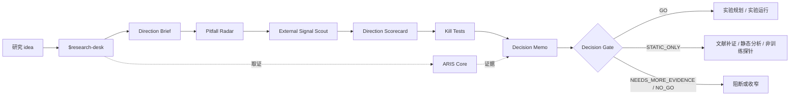

<div align="center">
  

  <h1>CodexResearchDesk</h1>

  <p>
    <strong>面向科研 idea 早筛、方向分诊和实验门控的 Codex App 工作台</strong>
  </p>

  <p>
    先判断一个 idea 是否值得做、哪里可能踩坑、需要什么最低成本证据；
    只有 gate 放行后，才进入训练、GPU 或长任务。
  </p>

  <p>
    <a href="https://github.com/Eternite-0/CodexResearchDesk"></a>
    
    
    
  </p>
</div>

---

## 定位

CodexResearchDesk 不是自动生成论文的流水线，也不是“给一个 A+B idea 就开跑实验”的执行器。它是一个前置研究控制台：

- **先筛 idea**：拆出核心 claim、必要条件、falsifier 和最低成本证据。
- **先找坑**：检查数据、指标、基线、新意、工程、评价和论文贡献风险。
- **先看外部信号**：用 GitHub、alphaXiv/HF Papers、HN、Semantic Scholar/OpenAlex 和手工社媒/企业信号判断方向是否只有 hype。
- **先做门控**：Decision Memo 和 `decision.json` 决定是否允许进入实验。

核心原则：**实验是昂贵的信息购买；不能改变决策的实验，不值得运行。**

## 工作流

默认链路：

```text
Idea
→ Direction Brief
→ Pitfall Radar
→ External Signal Scout
→ Direction Scorecard
→ Kill Tests
→ Decision Memo
→ Decision Gate
→ Static work / Experiments
```



各阶段的默认成本：

| 阶段 | 作用 | 默认成本 |
|---|---|---:|
| Direction Brief | 用 1-2 页收敛方向、claim、证据需求和初步 verdict。 | 0 GPU |
| Pitfall Radar | 提前暴露数据、指标、基线、新意、工程、评价和贡献风险。 | 0 GPU |
| External Signal Scout | 抓取外部软门控信号，判断是否只有热度、没有指标或工程支撑。 | 0 GPU |
| Direction Scorecard | 用 7 个维度给方向打分，但外部热度不直接进入总分。 | 0 GPU |
| Kill Tests | 设计最低成本淘汰测试，优先找能否定或收窄方向的检查。 | 默认 0 GPU |
| Decision Memo | 形成导师可审阅的正式裁决和 gate JSON。 | 视 verdict 而定 |

## 项目产物

每个项目维护自己的目录，避免不同方向互相污染：

```text
projects/<project-slug>/
  decisions/<idea-slug>/
    DECISION_MEMO.md
    decision.json
  signals/<idea-slug>/
    EXTERNAL_SIGNAL_LEDGER.md
    external_signals.json
  research-wiki/
  output/pdf/
  tmp/pdfs/
```

关键文件：

- `DECISION_MEMO.md`：完整推理、证据、风险和最终 verdict。
- `decision.json`：机器可读 gate 状态。
- `EXTERNAL_SIGNAL_LEDGER.md`：外部软门控账本。
- `external_signals.json`：外部信号结构化数据。
- `output/pdf/`：正式 PDF 交付物。
- `research-wiki/`：项目级长期记忆。

## 快速开始

安装依赖：

```powershell
python -m pip install -r requirements.txt
```

运行自检：

```powershell
python .\tools\self_check.py
```

用 Codex App 评估一个 idea：

```text
Use $research-desk to evaluate whether SAE features can explain MoE expert routing before any GPU experiment.
```

单独抓外部信号：

```powershell
python .\tools\external_signal_fetch.py scout "AutoResearchClaw autonomous research" `
  --project sae-moe-interpretability `
  --idea signal-explicit-smoke `
  --github-repo aiming-lab/AutoResearchClaw `
  --arxiv-id 2605.20025
```

检查某个项目是否允许实验：

```powershell
python .\tools\decision_gate.py latest .\projects\<project-slug> --mode experiment
```

检查是否允许静态工作：

```powershell
python .\tools\decision_gate.py latest .\projects\<project-slug> --mode static
```

## Skills

Codex App 会从 `.agents/skills/` 发现仓库级 skills。

### Desk Layer

| Skill | 作用 |
|---|---|
| `$research-desk` | 顶层入口，负责第一性原理拆解、证据调度和 gate 路由。 |
| `$direction-brief` | 生成早期方向简报。 |
| `$pitfall-radar` | 做 skeptical pre-mortem，提前找坑。 |
| `$external-signal-scout` | 用公开外部信号暴露 hype、工程和指标风险。 |
| `$direction-scorecard` | 按 7 个维度评分并给出推荐 verdict。 |
| `$kill-test-generator` | 生成低成本淘汰测试。 |
| `$decision-memo` | 生成正式 Decision Memo、PDF 和 gate JSON。 |
| `$report-style-auditor` | 交付前检查中文报告的模板残留和 AI 味。 |
| `$preflight-gate` | 在实验、pilot、GPU 任务前执行硬门控。 |
| `$aris-runner` | 将具体取证任务路由到 ARIS Core。 |

### ARIS Core

| 类型 | Skills |
|---|---|
| 文献与检索 | `research-lit`, `arxiv`, `openalex`, `semantic-scholar`, `deepxiv` |
| 查新与审查 | `novelty-check`, `research-review`, `kill-argument` |
| 长期记忆 | `research-wiki`, `wiki-enrich` |
| 实验与结果 | `experiment-plan`, `experiment-bridge`, `run-experiment`, `monitor-experiment`, `result-to-claim` |
| 写作与审计 | `citation-audit`, `paper-claim-audit`, `paper-plan` |

## Tools

| 工具 | 作用 |
|---|---|
| `tools/decision_gate.py` | 机械执行 go / no-go 检查。 |
| `tools/external_signal_fetch.py` | 抓取外部软门控信号并生成项目级账本。 |
| `tools/render_markdown_pdf.py` | 中文友好的 Markdown 到 PDF 渲染。 |
| `tools/research_wiki.py` | 项目级研究记忆管理。 |
| `tools/arxiv_fetch.py` | arXiv 检索与下载。 |
| `tools/openalex_fetch.py` | OpenAlex 学术图谱检索。 |
| `tools/semantic_scholar_fetch.py` | Semantic Scholar 检索。 |
| `tools/check_report_style.py` | 检查中文报告中的英文模板残留。 |
| `tools/check_ai_style.py` | 检查聊天残留、模糊归因、宣传腔和公式化表达。 |
| `tools/threat_scan.py` | 扫描会重新进入 agent 上下文的 wiki 内容。 |
| `tools/self_check.py` | 检查仓库可移植性、依赖、skills 和路径泄漏。 |

## Decision Gate

允许的 verdict：

| Verdict | 含义 | 是否允许实验 |
|---|---|---|
| `GO` | 证据足够强，可以进入实验。 | 允许 |
| `STATIC_ONLY` | 只能做文献、静态分析、公开 checkpoint、非训练探针。 | 阻断训练 |
| `NEEDS_MORE_EVIDENCE` | 关键证据缺失，需要继续补证。 | 阻断 |
| `NO_GO` | 当前不值得推进。 | 阻断 |
| `USER_OVERRIDE` | 用户明确接受风险并记录理由。 | 需显式 override |

`decision.json` 的 v0.2+ 字段示例：

```json
{
  "direction_score": 57,
  "risk_level": "high",
  "main_claim": "The core research claim.",
  "top_risks": ["risk 1", "risk 2", "risk 3"],
  "evidence_gaps": ["missing evidence"],
  "external_signal_score": 42,
  "external_signal_summary": "GitHub 有实现但缺少独立 benchmark，存在 hype 风险。",
  "external_signal_ledger": "projects/demo/signals/idea/EXTERNAL_SIGNAL_LEDGER.md",
  "hype_risk": "medium",
  "kill_tests": [],
  "allowed_next_actions": ["文献查新", "静态分析"],
  "blocked_actions": ["GPU 训练"],
  "next_review_condition": "完成低成本检查后复审。"
}
```

外部信号是软门控：它影响风险、优先级和下一步检查，但不单独决定 `GO` 或 `NO_GO`。

## 交付检查

中文 Decision Memo 交付前运行：

```powershell
python .\tools\check_report_style.py .\projects\<project-slug>\decisions\<idea-slug>\DECISION_MEMO.md
python .\tools\check_ai_style.py .\projects\<project-slug>\decisions\<idea-slug>\DECISION_MEMO.md
```

渲染 PDF：

```powershell
python .\tools\render_markdown_pdf.py `
  .\projects\<project-slug>\decisions\<idea-slug>\DECISION_MEMO.md `
  --output .\projects\<project-slug>\output\pdf\<idea-slug>_decision_memo.pdf `
  --preview `
  --preview-dir .\projects\<project-slug>\tmp\pdfs
```

## 示例

仓库内置 SAE / MoE interpretability 样例决策：

```powershell
python .\tools\decision_gate.py latest .\projects\sae-moe-interpretability --mode experiment
```

预期结果：

```text
BLOCK: STATIC_ONLY - STATIC_ONLY blocks experiment work
```

这表示当前 idea 可以继续文献补证、公开 checkpoint 分析和静态验证，但不能直接启动训练或 GPU pilot。

v0.2 方向分诊示例：

```text
examples/vlm-explainable-open-set-anomaly/
  DIRECTION_BRIEF.md
  PITFALL_RADAR.md
  DIRECTION_SCORECARD.md
  KILL_TESTS.md
  decision.json
```

## 设计原则

- **真实优先于动量**：弱 idea 不应被漂亮话包装。
- **先定义 falsifier**：没有可否定条件，就不要急着设计实验。
- **外部热度不是可信度**：GitHub stars、alphaXiv votes、社媒讨论只能暴露风险和优先级。
- **先杀坑再开跑**：最低成本淘汰测试优先于 GPU pilot。
- **门控必须可审计**：所有 expensive work 都必须由 Decision Memo 和 `decision.json` 放行。
- **PDF 是正式交付物**：给导师、合作者或组会看的内容不应只停留在 Markdown。

## 开源说明

CodexResearchDesk 包含一组精选的 ARIS / AutoResearch skills 与工具，派生自 [wanshuiyin/Auto-claude-code-research-in-sleep](https://github.com/wanshuiyin/Auto-claude-code-research-in-sleep)，遵循 MIT License。详见 [NOTICE](./NOTICE) 与 [vendor/ARIS_LICENSE](./vendor/ARIS_LICENSE)。

README 中的 Codex 图标来自 [LobeHub Icons / Dashboard Icons](https://dashboardicons.com/icons/external/codex-color)。本项目不是 OpenAI 官方项目，也不代表 OpenAI 背书或赞助。

## License

MIT. See [LICENSE](./LICENSE).
