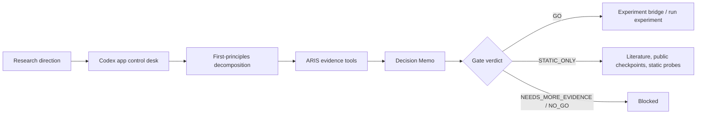

<div align="center">
  

  <h1>CodexResearchDesk</h1>

  <p>
    <strong>A Codex app first research decision desk built on curated ARIS / AutoResearch capabilities.</strong>
  </p>

  <p>
    Turn research ideas into evidence-backed <em>go / no-go</em> decisions before burning GPU time.
  </p>

  <p>
    <a href="https://github.com/Eternite-0/CodexResearchDesk"></a>
    
    
    
  </p>
</div>

---

## Why

AutoResearch / ARIS is powerful, but full autonomous research pipelines can become too large when the immediate problem is simpler:

> **Should this idea consume scarce research resources yet?**

CodexResearchDesk keeps the useful ARIS engine pieces, such as literature tools, review skills, research wiki, experiment bridge, and PDF rendering. It changes the top-level control logic: **Codex app drives a first-principles decision desk before experiments are allowed.**

The default artifact is not a loose idea list. It is a Decision Memo that answers:

- What is the core claim?
- What must be true for the idea to work?
- What evidence supports it?
- What evidence weakens it?
- What is the cheapest kill test?
- Is GPU/training work allowed now?

## Core Idea



## What This Project Is

- A lightweight project meant to be opened directly in **Codex app**.
- A decision layer over selected ARIS / AutoResearch capabilities.
- A system for producing advisor-ready Decision Memos in Markdown and PDF.
- A hard preflight gate for experiments, pilots, GPU jobs, and long-running training tasks.

## What This Project Is Not

- It is not a full clone of every AutoResearch workflow.
- It is not a visual dashboard in v0.1.
- It is not a GPU experiment launcher by default.
- It does not depend on a local upstream AutoResearch checkout at runtime.

## Project-Isolated Outputs

Every research project gets its own workspace:

```text
projects/<project-slug>/
  decisions/<idea-slug>/
    DECISION_MEMO.md
    decision.json
  research-wiki/
  output/pdf/
  tmp/pdfs/
```

This prevents multiple literature reviews, ideas, PDFs, previews, and wiki memories from sharing a flat namespace.

Example:

```text
projects/sae-moe-interpretability/
  decisions/sae-moe-routing-saes/
    DECISION_MEMO.md
    decision.json
  output/pdf/sae-moe-routing-saes_decision_memo.pdf
```

## Verdicts

| Verdict | Meaning | Experiment access |
|---|---|---|
| `GO` | Evidence is strong enough to proceed. | Allowed |
| `STATIC_ONLY` | The idea is plausible but needs cheap non-training evidence first. | Blocked |
| `NEEDS_MORE_EVIDENCE` | Key evidence is missing. | Blocked |
| `NO_GO` | The idea should not be pursued now. | Blocked |
| `USER_OVERRIDE` | The user explicitly accepts recorded risk. | Allowed only with override |

## Quick Start

Open this repository in Codex app, then install local Python dependencies:

```powershell
python -m pip install -r requirements.txt
```

Run the self-check:

```powershell
python .\tools\self_check.py
```

Evaluate a research idea in Codex app:

```text
Use $research-desk to evaluate whether SAE features can explain MoE expert routing before any GPU experiment.
```

Render a Decision Memo PDF:

```powershell
python .\tools\render_markdown_pdf.py `
  .\projects\<project-slug>\decisions\<idea-slug>\DECISION_MEMO.md `
  --output .\projects\<project-slug>\output\pdf\<idea-slug>_decision_memo.pdf `
  --preview `
  --preview-dir .\projects\<project-slug>\tmp\pdfs
```

Check whether experiments are allowed:

```powershell
python .\tools\decision_gate.py latest .\projects\<project-slug> --mode experiment
```

Check whether static work is allowed:

```powershell
python .\tools\decision_gate.py latest .\projects\<project-slug> --mode static
```

## Bundled Skills

Codex discovers repo-level skills from:

```text
.agents/skills/
```

Desk layer:

- `$research-desk`: top-level Codex app driven decision workflow.
- `$decision-memo`: writes formal Decision Memos and gate JSON.
- `$preflight-gate`: enforces experiment blocking.
- `$aris-runner`: routes tasks to bundled ARIS capabilities.

Curated ARIS core:

- Literature: `research-lit`, `arxiv`, `openalex`, `semantic-scholar`, `deepxiv`
- Review: `novelty-check`, `research-review`, `kill-argument`
- Memory: `research-wiki`, `wiki-enrich`
- Experiments: `experiment-plan`, `experiment-bridge`, `run-experiment`, `monitor-experiment`, `result-to-claim`
- Writing/audit: `citation-audit`, `paper-claim-audit`, `paper-plan`

## Bundled Tools

| Tool | Purpose |
|---|---|
| `tools/decision_gate.py` | Mechanical go/no-go enforcement |
| `tools/render_markdown_pdf.py` | Chinese-friendly Markdown to PDF rendering |
| `tools/research_wiki.py` | Persistent research memory |
| `tools/aris_tool_resolver.py` | Local ARIS skill/tool path resolution |
| `tools/arxiv_fetch.py` | arXiv search/download helper |
| `tools/openalex_fetch.py` | OpenAlex search helper |
| `tools/semantic_scholar_fetch.py` | Semantic Scholar helper |
| `tools/threat_scan.py` | Best-effort prompt-injection screening for wiki content |
| `tools/self_check.py` | Repository portability check |

## Sample Decision

This repository includes a sample SAE/MoE preflight decision:

```powershell
python .\tools\decision_gate.py latest .\projects\sae-moe-interpretability --mode experiment
```

Expected result:

```text
BLOCK: STATIC_ONLY - STATIC_ONLY blocks experiment work
```

Static analysis is still allowed:

```powershell
python .\tools\decision_gate.py latest .\projects\sae-moe-interpretability --mode static
```

## Design Principles

- **Truth before momentum**: a weak premise should be rejected early.
- **Experiments buy information**: do not run work that cannot change a decision.
- **First principles first**: define the claim, assumptions, and falsifier before searching for supporting evidence.
- **Evidence is typed**: supporting, opposing, adjacent, and missing evidence are different things.
- **PDF is the human handoff**: advisor-facing outputs should be readable without opening a code editor.

## Open Source Notice

This project includes a curated subset of skills and tools derived from [wanshuiyin/Auto-claude-code-research-in-sleep](https://github.com/wanshuiyin/Auto-claude-code-research-in-sleep), licensed under MIT. See [NOTICE](./NOTICE) and [vendor/ARIS_LICENSE](./vendor/ARIS_LICENSE).

The Codex icon in this README is sourced from [LobeHub Icons / Dashboard Icons](https://dashboardicons.com/icons/external/codex-color), also distributed under MIT-compatible open icon infrastructure. This project is not affiliated with, endorsed by, or sponsored by OpenAI.

## License

MIT. See [LICENSE](./LICENSE).
